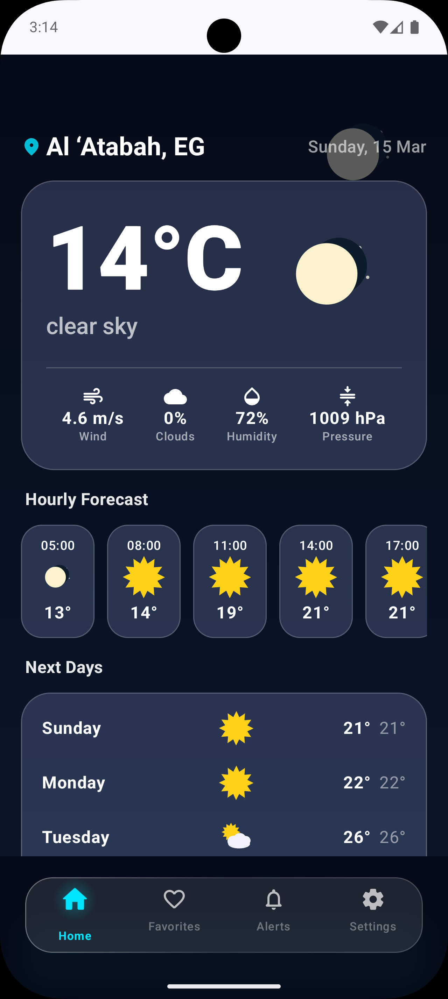
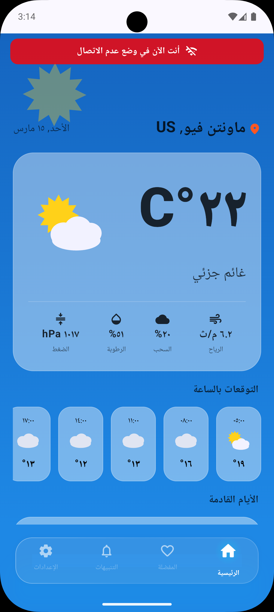
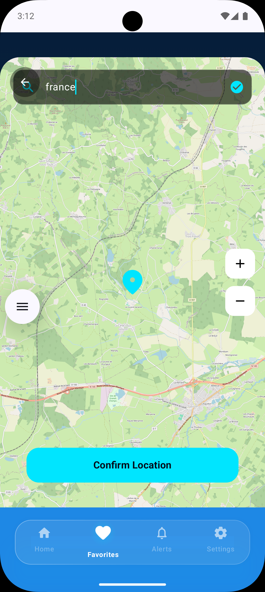
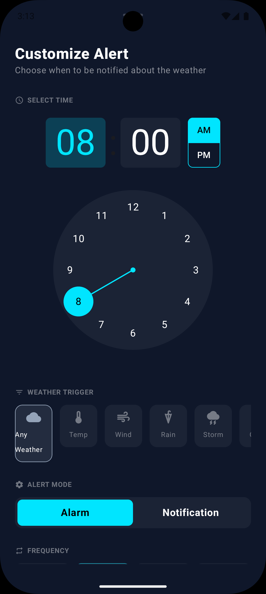
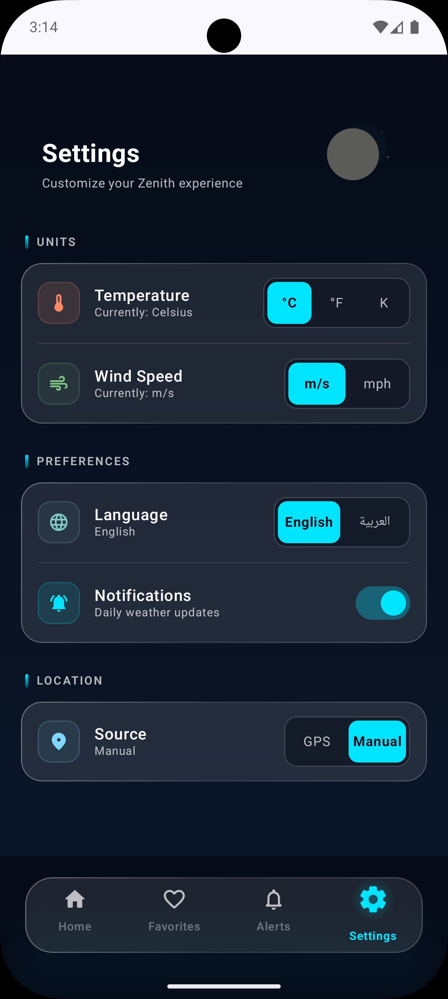

# 🚀 Zenith Weather
**Zenith** is a premium, native Android weather application built with **Jetpack Compose**. It provides a seamless, reactive user experience with a focus on precision, offline reliability, and elegant UI/UX.

  
  

---

## 📱 App Modules & Features

### 🏠 Home Screen (Dynamic UI)
The heart of Zenith, featuring a beautiful, card-based design that adapts to current conditions.
* **Real-time Metrics:** Displays Wind Speed, Clouds, Humidity, and Pressure.
* **Forecasts:** Detailed hourly forecast and a 5-day outlook with weather-specific icons.
* **Network Awareness:** A dedicated "Offline" banner appears when connectivity is lost, ensuring users know they are viewing cached data.

### 📍 Interactive Map Picker
A custom location selection tool built using `osmdroid`.
* **Precision Targeting:** Search for any city globally and confirm coordinates with an interactive pin.
* **Seamless Integration:** Instantly updates your favorite cities list with the selected location's data.

### 🔔 Smart Weather Alerts
Advanced background notification system powered by `WorkManager`.
* **Custom Scheduling:** An interactive time-picker to set exactly when you want to receive weather updates.
* **Trigger System:** Choose specific conditions (Rain, Storm, Temperature changes) to stay informed.
* **Alarm Mode:** Support for high-priority alerts to ensure you never miss a critical update.

### ⚙️ Settings & Localization
Complete control over the app's behavior and look.
* **Full Arabic Support:** Native RTL layout with localized numerals and translations.
* **Unit Toggles:** Quickly switch between Celsius, Fahrenheit, Kelvin, and wind speed units (m/s, mph).
* **Location Source:** Choice between automatic GPS tracking or manual city selection.

---

## 🛠️ Technical Excellence
The project is built using a modern **MVVM Architecture** following the **Single Source of Truth** principle:

* **UI:** 100% **Jetpack Compose** for a declarative and smooth UI.
* **Local Persistence:** **Room Database** for high-performance offline caching.
* **Background Tasks:** **WorkManager** for reliable alert scheduling.
* **Preferences:** **Jetpack DataStore** for reactive settings management.
* **Networking:** **Retrofit 2** with Coroutines for efficient API handling.

---

## 📸 Screenshots Gallery

| Home (Dark) | Home (Arabic/Offline) | Map Picker | Alerts | Settings |
| :---: | :---: | :---: | :---: | :---: |
|  |  |  |  |  |

---
